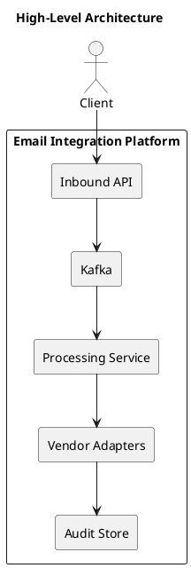
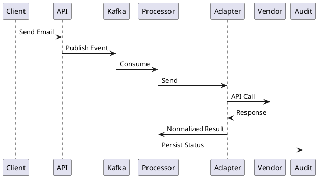
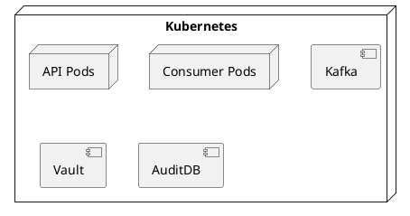

# Email Integration Platform
## High-Level & Low-Level Design (HLD + LLD)

**Organization:** XYZ  
**Document Type:** Architecture & Design  
**Audience:** Architects, Developers, SRE, Security, Audit  
**Status:** Approved for Implementation  

---

## 1. Purpose

This document defines the complete High-Level Design (HLD) and Low-Level Design (LLD) for the Email Integration Platform.  
The platform provides a secure, scalable, vendor-agnostic, and auditable mechanism for sending emails from internal systems via external email vendors.

---

## 2. Business Context

XYZ delivers high-volume transactional and regulatory communications through email.  
Direct integration with vendors creates operational, security, and compliance risks.  
This platform centralizes governance while delegating delivery to specialized vendors.

---

## 3. Scope

### In Scope
- REST-based email ingestion
- Event-driven asynchronous processing
- Vendor abstraction and routing
- End-to-end auditability
- Kubernetes-based deployment

### Out of Scope
- End-user email clients
- SMTP infrastructure
- Email template UI
- Long-term archival unless mandated

---

## 4. Stakeholders

- Internal Application Teams
- Product Owner
- Business Analysts
- Security
- Compliance & Audit
- SRE / Production Support
- Third-Party Email Vendors

---

## 5. Architectural Principles

- API-first
- Loose coupling
- Vendor neutrality
- Asynchronous processing
- Defense-in-depth security
- Observability by design

---

## 6. High-Level Architecture (HLD)

### Architecture Overview

API-first, event-driven architecture using Kafka to decouple ingestion and processing.



---

## 7. Core Components

### Inbound API Layer
- Spring Boot REST APIs
- OAuth 2.0 Client Credentials
- OpenAPI 3.0
- Idempotency & validation

### Event Streaming
- Apache Kafka
- Topics:
  - email.request.v1
  - email.retry.v1
  - email.dlq.v1

### Processing Layer
- Kafka consumers
- Business validation
- Vendor routing
- Retry handling

### Vendor Adapter Layer
- Adapter per vendor
- Timeout, retry, circuit breaker
- Response normalization

### Audit Layer
- Immutable append-only store
- Correlation ID-based traceability

---

## 8. End-to-End Flow



---

## 9. Security Design

- OAuth 2.0 authentication
- TLS 1.2+
- Secrets from Vault / KMS
- Encryption at rest and in transit
- No PII in logs

---

## 10. Scalability & Performance

- Stateless services
- Horizontal Pod Autoscaling
- Kafka back-pressure
- Async processing
- Thousands of messages/sec

---

## 11. Reliability & Fault Tolerance

- Idempotent processing
- Exponential backoff retries
- Circuit breakers
- Dead-letter queues
- Multi-vendor support

---

## 12. Observability

### Metrics
- email.ingested.count
- email.sent.success
- email.sent.failure
- vendor.latency

### Alerts
- Vendor failure rate
- Kafka lag
- Auth failures

---

## 13. Compliance & Audit

- Full traceability
- Immutable audit logs
- Retention policies
- Audit evidence generation

---

## 14. Low-Level Design (LLD)

### Module Structure

```text
email-integration-service
 ├── api
 ├── service
 ├── messaging
 ├── vendor
 ├── audit
 ├── security
 ├── config
 ├── model
 ├── exception
 └── util
```

---

### API Endpoints

- POST /v1/emails
- GET /v1/emails/{messageId}/status

---

### Data Models

```java
EmailRequest
EmailEvent
VendorResponse
EmailStatus
```

---

### Kafka Topics

| Topic | Purpose |
|------|--------|
| email.request.v1 | Ingestion |
| email.retry.v1 | Retry |
| email.dlq.v1 | Poison |

---

### Error Handling

| Error | Action |
|-----|-------|
| Validation | Reject |
| Timeout | Retry |
| Vendor 4xx | Fail |
| Auth | Alert |
| Serialization | DLQ |

---

## 15. Deployment Architecture



---

## 16. Risks & Mitigations

| Risk | Mitigation |
|----|-----------|
| Vendor outage | Multi-vendor routing |
| Duplicates | Idempotency |
| PII leakage | Logging controls |
| Spikes | Kafka buffering |

---

## 17. Conclusion

This document provides a complete, production-grade HLD and LLD for the Email Integration Platform at XYZ.
